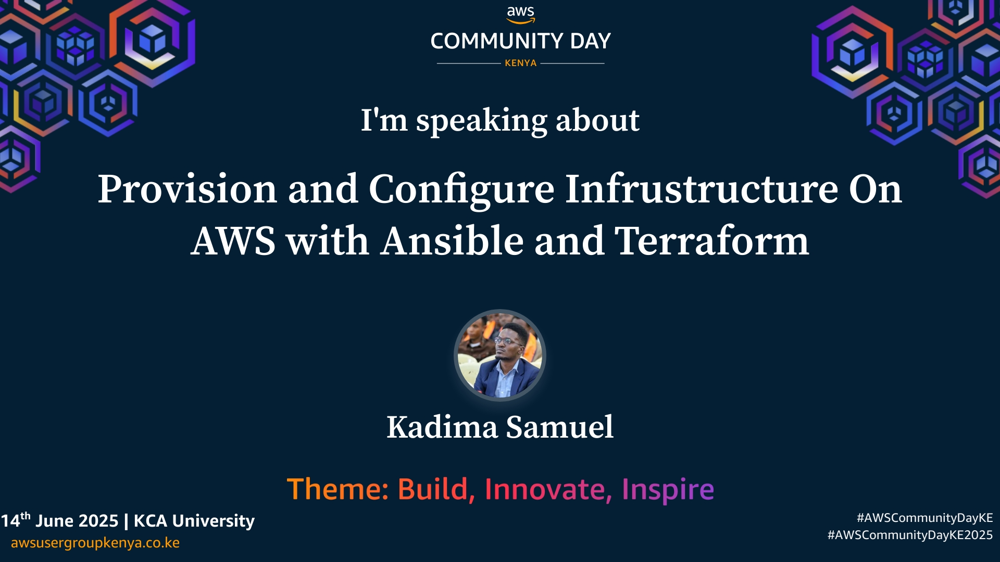

# Provision And Configure Infrastructure On AWS With Terraform & Ansible

This technical demo showcases how to provision and configure infrastructure on AWS using Terraform and Ansible. It demonstrates the power of Infrastructure as Code (IaC) with Terraform for creating and managing AWS resources, alongside Ansible’s capabilities for automating server configuration and software deployment. The session offers practical insights for DevOps engineers and cloud professionals looking to build scalable, maintainable, and automated cloud environments.

**AWS** is a leading cloud computing platform that provides on-demand access to scalable computing resources such as virtual servers (EC2), networking (VPC), storage (S3), and more. It enables businesses and developers to deploy applications and infrastructure globally with flexibility and cost-efficiency.

**Terraform** is an open-source Infrastructure as Code (IaC) tool that allows users to define and provision cloud resources using declarative configuration files. It enables version-controlled, repeatable infrastructure deployments.

**Ansible** is an open-source automation tool used for configuration management, application deployment, and orchestration. It uses simple YAML-based playbooks to define tasks and manage system configurations.

